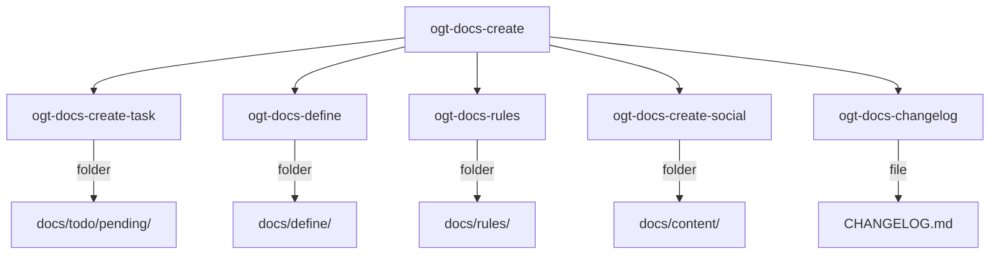
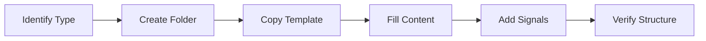

# OGT Docs - Create

Root skill for creating new documentation entities.

## Overview

This skill routes to specialized creation workflows based on what type of document you're creating. Every entity becomes a folder with appropriate files and signals.



## When to Use

- Creating new tasks
- Adding definitions (features, code, business, etc.)
- Establishing new rules
- Creating social/marketing content
- Updating changelog

## Quick Reference

| Creating      | Sub-Skill                   | Target                 |
| ------------- | --------------------------- | ---------------------- |
| Task          | `ogt-docs-create-task`      | docs/todo/pending/     |
| Feature       | `ogt-docs-define-feature`   | docs/define/features/  |
| Business def  | `ogt-docs-define-business`  | docs/define/business/  |
| Code def      | `ogt-docs-define-code`      | docs/define/code/      |
| Marketing def | `ogt-docs-define-marketing` | docs/define/marketing/ |
| Branding def  | `ogt-docs-define-branding`  | docs/define/branding/  |
| Tool doc      | `ogt-docs-define-tools`     | docs/define/tools/     |
| Code rule     | `ogt-docs-rules-code`       | docs/rules/code/       |
| Git rule      | `ogt-docs-rules-git`        | docs/rules/git/        |
| Social post   | `ogt-docs-create-social`    | docs/content/social/   |
| Changelog     | `ogt-docs-changelog`        | CHANGELOG.md           |

---

## Creation Workflow

All creation follows the same pattern:



### Step 1: Identify Type

Determine what you're creating:

| If you need to...          | Create a...     | Location              |
| -------------------------- | --------------- | --------------------- |
| Track work to do           | Task            | docs/todo/pending/    |
| Document a product feature | Feature         | docs/define/features/ |
| Document code architecture | Code definition | docs/define/code/     |
| Establish coding standard  | Code rule       | docs/rules/code/      |
| Record what changed        | Changelog entry | CHANGELOG.md          |

### Step 2: Create Folder

```bash
# Use slug format: lowercase, hyphens, no spaces
mkdir -p docs/{section}/{category}/{slug}

# Examples
mkdir -p docs/todo/pending/user-auth-flow
mkdir -p docs/define/features/dark-mode
mkdir -p docs/rules/code/error-handling
```

### Step 3: Copy Template

```bash
# Copy appropriate template
cp docs/_templates/{type}.md docs/{path}/{slug}/{type}.md

# Examples
cp docs/_templates/task.md docs/todo/pending/user-auth-flow/task.md
cp docs/_templates/feature.md docs/define/features/dark-mode/feature.md
cp docs/_templates/rule.md docs/rules/code/error-handling/rule.md
```

### Step 4: Fill Content

Edit the template with actual content. See sub-skill documentation for required sections.

### Step 5: Add Signals

```bash
# Common signals
echo '{"schema": "1.0", "created": "'$(date -Iseconds)'"}' > {folder}/.version

# Type-specific signals
echo "high" > docs/todo/pending/{task}/.priority
touch docs/rules/code/{rule}/.enforced_by
```

### Step 6: Verify Structure

```bash
# Verify folder has required files
ls -la docs/{path}/{slug}/

# Expected output example for task:
# task.md
# .version
# .priority
```

---

## Templates Overview

### Task Template

```markdown
# Task: {Title}

## Summary

{What and why}

## Objectives

- Objective 1
- Objective 2

## Acceptance Criteria

- [ ] Criterion 1
- [ ] Criterion 2

## Dependencies

{None or list}

## Estimated Effort

{Size} ({time})
```

### Feature Template

```markdown
# Feature: {Name}

## Summary

{What the feature does}

## User Stories

As a {user}, I want to {action}, so that {benefit}.

## Scope

### In Scope

- Item 1

### Out of Scope

- Item 1

## Success Metrics

- Metric 1
```

### Definition Template

```markdown
# {Name}

## Summary

{One paragraph}

## Details

{Full explanation}

## Examples

{Examples}

## Related

- {Links}
```

### Rule Template

```markdown
# Rule: {Name}

## Summary

{One sentence}

## Rationale

{Why}

## The Rule

{MUST/SHOULD/MAY statements}

## Examples

### Correct

{example}

### Incorrect

{example}

## Enforcement

{How enforced}
```

---

## Batch Creation

Create multiple related items at once:

```bash
#!/bin/bash
# create-feature-with-tasks.sh

FEATURE=$1

# Create feature definition
mkdir -p docs/define/features/$FEATURE
cat > docs/define/features/$FEATURE/feature.md << EOF
# Feature: $(echo $FEATURE | tr '-' ' ' | sed 's/\b\(.\)/\u\1/g')

## Summary

TODO: Add summary

## User Stories

As a user, I want to TODO, so that TODO.
EOF

# Create initial tasks
for task in "design" "implement" "test" "document"; do
  mkdir -p docs/todo/pending/${FEATURE}-${task}
  cat > docs/todo/pending/${FEATURE}-${task}/task.md << EOF
# Task: $(echo $FEATURE | tr '-' ' ' | sed 's/\b\(.\)/\u\1/g') - $(echo $task | sed 's/\b\(.\)/\u\1/g')

## Summary

${task^} the $FEATURE feature.

## Objectives

- TODO

## Acceptance Criteria

- [ ] TODO
EOF
  echo "medium" > docs/todo/pending/${FEATURE}-${task}/.priority
done

echo "Created feature: $FEATURE"
echo "Created tasks: ${FEATURE}-design, ${FEATURE}-implement, ${FEATURE}-test, ${FEATURE}-document"
```

Usage:

```bash
./create-feature-with-tasks.sh dark-mode
```

---

## Naming Conventions

### Slug Format

All folder names use slug format:

| Rule               | Example                          |
| ------------------ | -------------------------------- |
| Lowercase          | `user-auth` not `User-Auth`      |
| Hyphens for spaces | `dark-mode` not `dark_mode`      |
| No special chars   | `oauth2` not `oauth2.0`          |
| Descriptive        | `steam-oauth-provider` not `sop` |
| Under 30 chars     | Keep it readable                 |

### Good Names

```
docs/todo/pending/add-steam-oauth
docs/define/features/dark-mode-toggle
docs/rules/code/no-implicit-any
```

### Bad Names

```
docs/todo/pending/Add Steam OAuth          # Spaces, caps
docs/define/features/dark_mode_toggle      # Underscores
docs/rules/code/rule1                      # Not descriptive
```

---

## Validation

After creating any document:

### Check Required Files

```bash
# Task
test -f docs/todo/pending/{slug}/task.md || echo "MISSING: task.md"
test -f docs/todo/pending/{slug}/.priority || echo "MISSING: .priority"

# Feature
test -f docs/define/features/{slug}/feature.md || echo "MISSING: feature.md"
test -f docs/define/features/{slug}/mvp.md || echo "MISSING: mvp.md"

# Rule
test -f docs/rules/{category}/{slug}/rule.md || echo "MISSING: rule.md"
test -f docs/rules/{category}/{slug}/.enforced_by || echo "MISSING: .enforced_by"
```

### Check Required Sections

```bash
# For any markdown file, check for required headings
file=$1
required=("## Summary" "## Objectives" "## Acceptance Criteria")

for section in "${required[@]}"; do
  grep -q "$section" "$file" || echo "MISSING: $section in $file"
done
```

---

## Common Creation Patterns

### New Feature Flow

1. Create feature definition
2. Create mvp.md defining scope
3. Create phase_0.md for initial work
4. Create tasks for phase_0

```bash
# 1. Feature folder
mkdir -p docs/define/features/search

# 2. Feature definition
cat > docs/define/features/search/feature.md << 'EOF'
# Feature: Global Search

## Summary
Fuzzy search across all content types.
EOF

# 3. MVP scope
cat > docs/define/features/search/mvp.md << 'EOF'
# MVP: Global Search

## In MVP
- Phase 0 only

## Definition of Done
- Search returns results in <100ms
- Fuzzy matching works
EOF

# 4. Phase 0
cat > docs/define/features/search/phase_0.md << 'EOF'
# Phase 0: Basic Search

## Deliverables
- MiniSearch integration
- Global search component
EOF

# 5. Tasks
mkdir -p docs/todo/pending/search-minisearch-setup
# ... create task
```

### New Rule Flow

1. Identify pattern to standardize
2. Create rule folder
3. Write rule with examples
4. Configure enforcement
5. Announce to team

```bash
# 1. Rule folder
mkdir -p docs/rules/code/async-await

# 2. Rule definition
cat > docs/rules/code/async-await/rule.md << 'EOF'
# Rule: Prefer async/await

## Summary
SHOULD use async/await over .then() chains.

## Rationale
Improved readability and error handling.

## The Rule
...
EOF

# 3. Examples
cat > docs/rules/code/async-await/examples.md << 'EOF'
# Examples
...
EOF

# 4. Enforcement
echo "eslint prefer-async-await" > docs/rules/code/async-await/.enforced_by

# 5. Configure ESLint
# Edit .eslintrc.js
```

---

## Signal Files Quick Reference

| Signal         | Used For    | Content                  |
| -------------- | ----------- | ------------------------ |
| `.version`     | All         | JSON schema version      |
| `.priority`    | Tasks       | critical/high/medium/low |
| `.enforced_by` | Rules       | List of tools            |
| `.status`      | Definitions | draft/review/approved    |
| `.created_at`  | All         | ISO timestamp            |
| `.created_by`  | All         | Author name              |

---

## Creation Checklist

Before finalizing any created document:

- [ ] Folder uses slug format
- [ ] Primary file exists (task.md, feature.md, etc.)
- [ ] .version signal added
- [ ] Required sections present
- [ ] No TODO placeholders remain
- [ ] Links are valid
- [ ] Spelling/grammar checked
- [ ] Related documents cross-referenced
