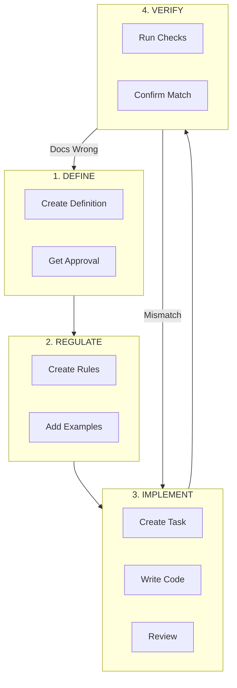

# OGT Docs - Documentation as Source of Truth

## Philosophy

**Documentation is the database of decisions. Code is merely its implementation.**

```
┌─────────────────────────────────────────────────────────────────┐
│                    THE DOC-FIRST PRINCIPLE                      │
├─────────────────────────────────────────────────────────────────┤
│  1. Documentation DEFINES what something IS                     │
│  2. Code IMPLEMENTS what documentation specifies                │
│  3. Conflicts RESOLVE in favor of documentation                 │
│                                                                 │
│  If docs say X and code does Y → CODE IS WRONG                  │
└─────────────────────────────────────────────────────────────────┘
```

## When to Use This Skill

Use `ogt-docs` when you need to:

- Understand the docs/ folder structure
- Find the right sub-skill for a specific task
- Initialize a new docs-first project
- Navigate between definition types

**For specific tasks, use the specialized sub-skills listed below.**

## Documentation Structure Overview

```
docs/
├── definitions/              # WHAT things ARE
│   ├── business/             # Business model, pricing, users
│   ├── features/             # Product features and specs
│   ├── technical/            # Architecture, services, data
│   └── domain/               # Domain-specific concepts
│
├── rules/                    # HOW to IMPLEMENT
│   ├── code/                 # Coding standards
│   │   ├── frontend/
│   │   ├── backend/
│   │   └── infra/
│   ├── git/                  # Version control rules
│   └── domain/               # Domain-specific rules
│
├── todo/                     # TASK management
│   ├── pending/              # Not started
│   ├── in_progress/          # Being worked on
│   ├── review/               # Awaiting review
│   ├── blocked/              # Cannot proceed
│   ├── done/                 # Completed & verified
│   └── rejected/             # Declined tasks
│
├── guides/                   # HOW-TO documents
│   └── {topic}/
│
└── social/                   # Marketing & communications
    ├── campaigns/
    ├── content/
    └── branding/
```

## The Folder-as-Entity Pattern

Every documentable item is a **folder** containing:

```
{item_slug}/
├── {type}.md                 # Primary document (task.md, feature.md, etc.)
├── {supporting_files}.md     # Additional documentation
└── .{signal_files}           # Status markers and metadata
```

**Benefits:**

- Move entire folder between workflow stages
- Attach unlimited supporting files
- Signal status via dot-files
- Version and track changes atomically

## Sub-Skills Reference

### Definitions (WHAT things ARE)

| Sub-Skill                   | Purpose                        | Use When                          |
| --------------------------- | ------------------------------ | --------------------------------- |
| `ogt-docs-define`           | General definition guidance    | Need overview of definition types |
| `ogt-docs-define-business`  | Business model, pricing, users | Defining business concepts        |
| `ogt-docs-define-feature`   | Product features and specs     | Specifying a new feature          |
| `ogt-docs-define-code`      | Technical architecture         | Defining services, data models    |
| `ogt-docs-define-marketing` | Brand, messaging, audience     | Marketing definitions             |
| `ogt-docs-define-branding`  | Visual identity, tone          | Brand guidelines                  |
| `ogt-docs-define-tools`     | Tooling and CLI specs          | Defining developer tools          |

### Rules (HOW to IMPLEMENT)

| Sub-Skill                   | Purpose                   | Use When                    |
| --------------------------- | ------------------------- | --------------------------- |
| `ogt-docs-rules`            | General rules guidance    | Need overview of rule types |
| `ogt-docs-rules-code`       | Coding standards overview | General code rules          |
| `ogt-docs-rules-code-front` | Frontend-specific rules   | React, CSS, components      |
| `ogt-docs-rules-code-back`  | Backend-specific rules    | API, database, services     |
| `ogt-docs-rules-code-infra` | Infrastructure rules      | Docker, CI/CD, deployment   |
| `ogt-docs-rules-git`        | Version control rules     | Commits, branches, PRs      |

### Tasks (WHAT to DO)

| Sub-Skill              | Purpose                 | Use When                       |
| ---------------------- | ----------------------- | ------------------------------ |
| `ogt-docs-create-task` | Create and manage tasks | Need to create/update a task   |
| `ogt-docs-audit-task`  | Verify task completion  | Checking if task is truly done |

### Other

| Sub-Skill                | Purpose                   | Use When                          |
| ------------------------ | ------------------------- | --------------------------------- |
| `ogt-docs-create`        | General creation guidance | Need to create any doc type       |
| `ogt-docs-create-social` | Marketing content         | Creating social/marketing content |
| `ogt-docs-audit`         | General audit guidance    | Auditing documentation            |
| `ogt-docs-init`          | Initialize docs structure | Setting up new project            |
| `ogt-docs-config`        | Configuration options     | Customizing docs workflow         |

## Workflow Overview



## Quick Start

### "I need to define something new"

→ Use `ogt-docs-define` to understand types, then the specific sub-skill

### "I need to create a task"

→ Use `ogt-docs-create-task`

### "I need to check if a task is really done"

→ Use `ogt-docs-audit-task`

### "I need to add coding rules"

→ Use `ogt-docs-rules-code` or the specific frontend/backend/infra variant

### "I need to set up docs for a new project"

→ Use `ogt-docs-init`

## Naming Conventions

| Element          | Format                | Example                                 |
| ---------------- | --------------------- | --------------------------------------- |
| Folder slugs     | snake_case            | `global_search`, `user_auth`            |
| Primary files    | lowercase type        | `task.md`, `feature.md`, `rule.md`      |
| Supporting files | lowercase descriptive | `phase_0.md`, `notes.md`, `progress.md` |
| Signal files     | dot + snake_case      | `.blocked_reason`, `.approved_by_human` |

## Signal Files Reference

Signal files are dot-files that indicate status or metadata.

| Signal                 | Type    | Meaning                     |
| ---------------------- | ------- | --------------------------- |
| `.version`             | Content | Schema/doc version (JSON)   |
| `.blocked`             | Empty   | Item is blocked             |
| `.blocked_reason`      | Content | Why it's blocked            |
| `.approved`            | Empty   | Approved for implementation |
| `.approved_by_{name}`  | Empty   | Who approved                |
| `.rejected`            | Empty   | Rejected                    |
| `.rejected_reason`     | Content | Why rejected                |
| `.verified`            | Empty   | Implementation verified     |
| `.completed_at`        | Content | Completion timestamp        |
| `.assigned_to_{agent}` | Empty   | Who's working on it         |
| `.pr_link`             | Content | Associated PR URL           |
| `.depends_on`          | Content | Dependencies list           |

## The Golden Rules

1. **If it's not documented, it doesn't exist**
2. **If code contradicts docs, code is wrong**
3. **Never trust "done" status without verification**
4. **Move folders, don't copy files**
5. **Signal with dot-files, don't edit status fields**
